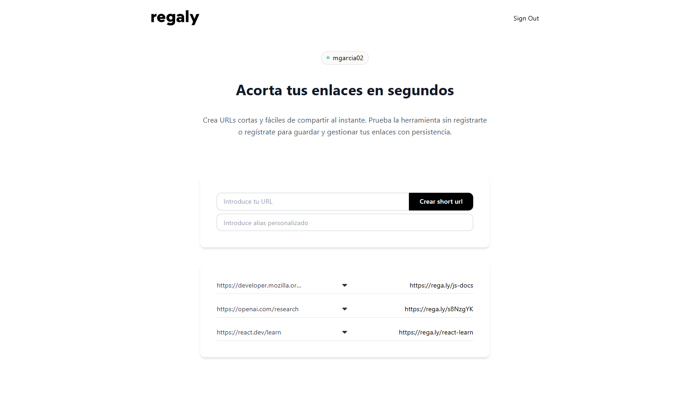

# Short URL
 
Acortador de URLs full-stack con soporte para modo demo y sesión autenticada. Genera códigos cortos personalizados o automáticos, redirige al destino original y lleva un registro de clics por URL.
 


 
## Stack
 
| Capa | Tecnología |
|---|---|
| Frontend | React · TypeScript · Vite · Tailwind CSS |
| Backend | Node.js · Express · TypeScript |
| Base de datos | Prisma · SQLite |
| Autenticación | JWT · cookies HTTP-only |

 
## Puesta en marcha

### Backend
 
```bash
cd backend
npm install
```
 
Crea el archivo `backend/.env`:
 
```env
DATABASE_URL="file:./dev.db"
JWT_SECRET=tu_secreto_aquí
```
 
```bash
npx prisma migrate dev
npm run dev
# → http://localhost:3000
```
 
### Frontend
 
```bash
cd frontend
npm install
npm run dev
# → http://localhost:5173
```
 
## API
 
| Método | Ruta | Descripción |
|---|---|---|
| `POST` | `/urls/` | Acorta una URL |
| `GET` | `/resolve/:shortCode` | Redirige a la URL original |
| `GET` | `/urls/` | Lista todas las URLs del usuario |
| `DELETE` | `/urls/:shortCode` | Elimina una URL |

 
## Autenticación
 
El sistema funciona en dos modos:
 
**Modo demo** — Las URLs se guardan en `localStorage`. No requiere cuenta ni backend.
 
**Modo autenticado** — Las URLs se persisten en base de datos asociadas al usuario. La autenticación usa JWT almacenado en cookies HTTP-only, protegiendo contra ataques XSS. El frontend adapta su comportamiento automáticamente según el estado de sesión.

 
## Estructura del proyecto
 
```
short-url-project/
├── backend/
│   ├── src/          # Rutas, controladores, servicios y repositorios
│   └── prisma/       # Esquema de base de datos y migraciones
└── frontend/
    └── src/          # Componentes, páginas y servicios
```

 ---
 
*Proyecto personal. Desarrollado para practicar autenticación con JWT, arquitectura por capas en Express y gestión de estado en el frontend.*